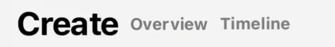

# SwiftUI Tab Title Bar
A SwiftUI view which will prominently display the currently selected tab title and present the user an option to change to another tab.

This is a component that is initialized with a current index value and an array of Tab Items. Tab Items are a struct that contains a view and a target index. 

TabItem conforms to identifiable with a UUID predefined, however you can assign your own UUID should you so choose. 

This is a component that was pulled out of my app Resolute to be shared as an open source package. 

# New in Version 1.1
- The user can tap on the inactive tabs and that tab will be selected.
- If the developer has more tabs than can fit in a horizontally constrained space, the view will collapse into a menu button which will display the currently selected title and on tap will open a menu picker to change the tab.

# New in Version 1.2
- The developer can now add an SF Symbol next to the text view. The title will then be a SwiftUI Label object. Symbol is an optional value on TabItem.  

# New Issues
- I created an ItemWithModifier view with the intention to use it in the Menu style picker. But it appears the target index value never matches the currently selected tab. This is likely an easy fix, but at this time I'm going around in circles trying to fix it. When this is fixed, SingleTabTitleModifier can be deprecated.  

# Demo
<p align="center">
    
</p>

# Scope
- Ultimately, this is a list of items in either an HStack or a Menu.
- The currentTabSelection a `Binding<Int>`
- TabItem contains the following.
    - An index, this is used to determine if the view is currently selected. 
    - A Text view, this is the view that will animate between the active and inactive state. 
- The states as of 1.0 are defined as follows.
    - Active: Font Size of 24 with a foreground color of .primary.
    - Inactive: Font Size of 12 with a foreground color of .secondary.
- When the Menu style TabTitleBar is presented, you can change the following.
    - changeTabLabel: 
        - This is used on the Menu button to guide the user to tap here to change the tab. 
        - This is a String value with a default value of "Change Tab". 
    - changeTabSymbol:
        - This is the icon used on the Menu button, this is an SF Symbol.
        - This is a String value with a default value of "arrow.left.arrow.right.square"


# Simple Usage Example
This will result in all Titles being visable and you can tab each title to change the tab
```
struct ExampleView: View {
    @State var tabSelection: Int = 0
    
    var tabItems: [TabItem] = Array(0...2).map({
        TabItem(
            view: Text("Item \($0)"), 
            index: $0,
            symbol: "$0.circle"
        )
    })
    
    var body: some View {
        TabTitleBar(
            currentTabSelection: $tabSelection,
            tabItems: tabItems,
            symbol: "\($0).circle"
        )
    }
}
```

# Large Usage Example
This will result in a the Tab Title to the left and a change tab Menu button to the right. 
```
struct ExampleView: View {
    @State var tabSelection: Int = 0
    
    var tabItems: [TabItem] = [
        TabItem(
            view: Text("Shoes"),
            index: 0
        ),
        TabItem(
            view: Text("Workouts"),
            index: 1
        ),
        TabItem(
            view: Text("Recents"),
            index: 2
        ),
        TabItem(
            view: Text("Equipment"),
            index: 3
        ),
        TabItem(
            view: Text("Routing"),
            index: 4
        ),
        TabItem(
            view: Text("Replacements"),
            index: 5
        ),
        TabItem(
            view: Text("Settings"),
            index: 6
        )
    ]
    
    var body: some View {
        TabTitleBar(
            currentTabSelection: $tabSelection,
            tabItems: tabItems
        )
    }
}
```

# Complex Usage Example
This will result in a the Tab Title to the left and a change tab Menu button to the right. 
- This example will have symbols with the exception of the center item.
- This will also demonstrate that if you have a very long tab title, it will break to a new line.
```
struct ExampleView: View {
    @State var tabSelection: Int = 0
    
    var tabItems: [TabItem] = [
        TabItem(
            view: Text("Long Text Here"),
            index: 0,
            symbol: "circle.dashed"
        ),
        TabItem(
            view: Text("More Long Text Here"),
            index: 1
            // It is valid to not define a symbol. If you do not define a symbol, a Text view will be rendered. 
        ),
        TabItem(
            view: Text("This is supposed to break to a new line"),
            index: 2,
            symbol: "circle.hexagongrid"
        )
    ]
    
    var body: some View {
        TabTitleBar(
            currentTabSelection: $tabSelection,
            tabItems: tabItems,
            changeTabLabel: "Switch Tab",
            changeTabSymbol: "arrow.triangle.branch"
        )
    }
}
```
